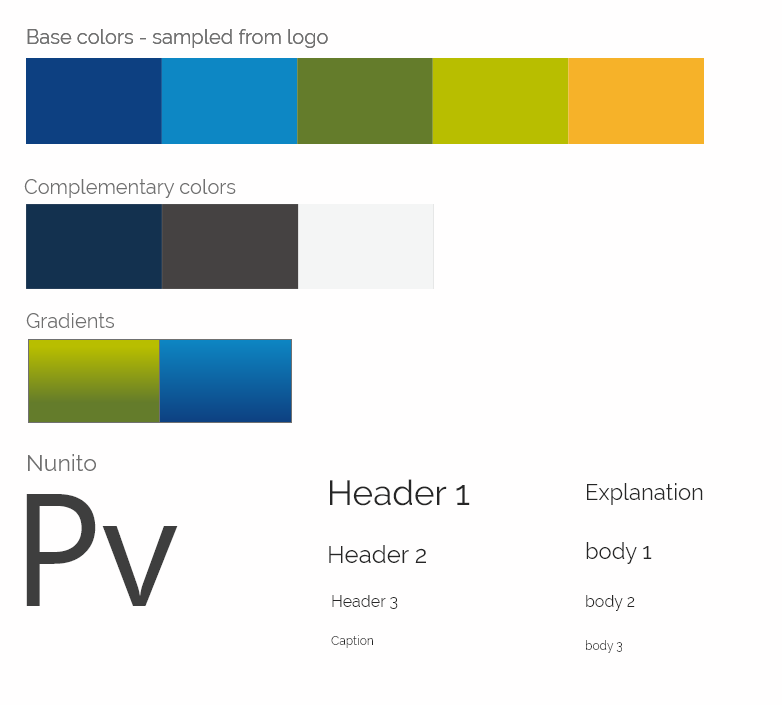
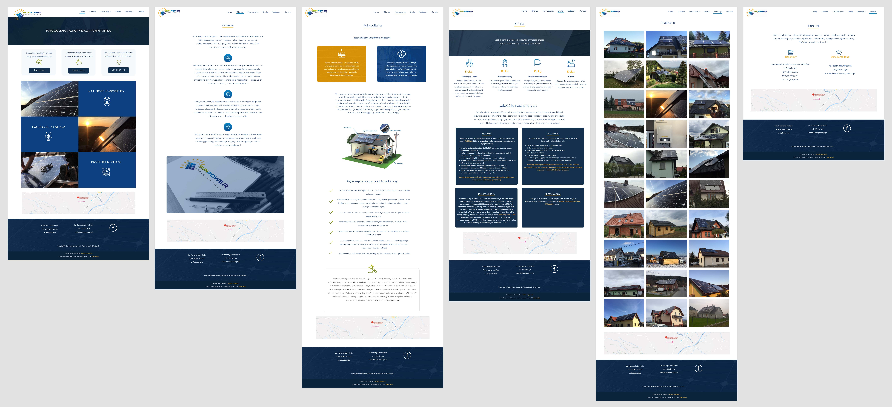

### Website for polish renewable energy company

Layout based on grid, flexbox & media queries to achieve responsiveness.

Desinged and prototyped in AdobeXD.

#### Page content
* Website with subpages contains main company profile and services.

#### For users:

You can visit website on: https://sunpowerpv.pl/

#### For developers [Setup instructions];
* You need NPM and GULP installed
* Copy or clone repository
* Cd to project directory and run `gulp`
* Website will be served on: `http://localhost:3000/`

#### Dependencies
* Website was created with [Flexbox Layout](https://css-tricks.com/snippets/css/a-guide-to-flexbox/) and [CSS Grid](https://css-tricks.com/snippets/css/complete-guide-grid/)
* Icons by [Flaticon](https://www.flaticon.com/)
* Automation by [Gulp](https://gulpjs.com/)
* build and deployment by [Netlify](https://www.netlify.com/)